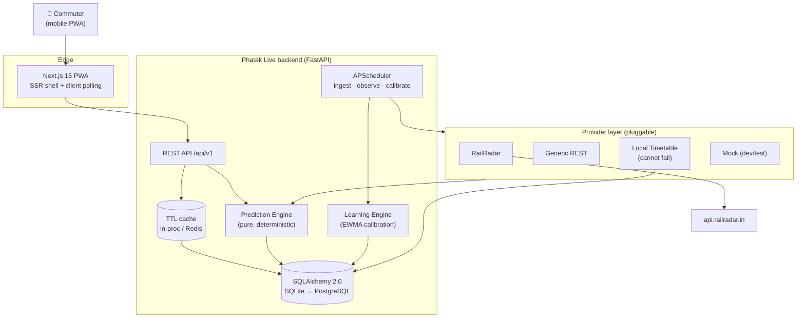
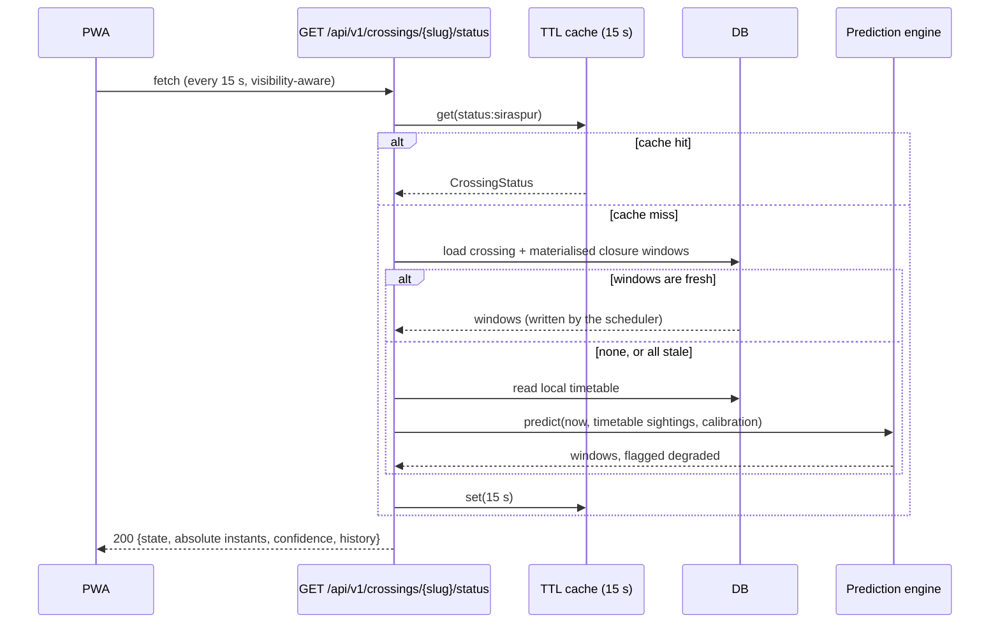
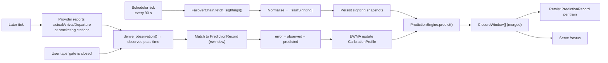

# Stage 2 — System Architecture

**Status:** Accepted · **Date:** 2026-07-25

---

## 1. One-paragraph summary

Phatak Live is a read-mostly prediction service. A background scheduler polls train-data
providers on a fixed cadence, normalises whatever comes back into a provider-neutral
`TrainSighting`, hands it to a pure-functional prediction engine that produces merged
**gate closure windows**, persists both the windows and the predictions that produced them,
and serves a tiny, aggressively cached read API. A learning engine later compares each
prediction against an observation and updates a per-crossing calibration profile. The
frontend is a Next.js PWA that renders one screen and counts down.

The two load-bearing ideas are: **the provider is replaceable** and **the prediction engine is
pure**. Everything else follows from those.

## 2. Context diagram



## 3. Request path — "is the gate open?"



Two things about that diagram are load-bearing.

**The API never calls a provider.** Closure windows are *materialised by the scheduler* and the
read path only projects them onto `now`. So a user request cannot hang on a slow upstream API,
and a total provider outage degrades the answer instead of removing it.

**The fallback path is a local database read.** When no fresh windows exist — cold start, crashed
worker, provider outage — the engine runs inline over the offline timetable. That is cheap,
cannot fail, and is honestly labelled `degraded: true` with reduced confidence.

## 4. Data flow: ingest → predict → observe → calibrate



That loop is the product's moat: it turns "a physics guess" into "what this specific gate
actually does at 7 a.m. on a Tuesday."

## 5. The domain model

### 5.1 Why "closure window" is the central object

Users don't care about trains. They care about *intervals during which they cannot cross*.
So the engine's output type is `ClosureWindow(open_at, close_at, cause[], confidence)`, and
two trains 90 seconds apart produce **one** window, not two. Merging is not a display concern;
it is domain logic, because a gate that reopens for 40 seconds has not really reopened.

### 5.2 Geometry model

A crossing is defined by the segment it sits in, not by a bare coordinate:

```
prev_station (BHD) ──d_prev──► ✕ crossing ──d_next──► next_station (KHKN)
```

`chainage_km` of the crossing along a train's route = `route[prev].distance_km + d_prev` for an
UP train, and the mirror for a DOWN train. This means we can compute a pass time from
*per-station timings alone* — no GPS required — which is what makes the cheap station-board
ingestion strategy viable (see RESEARCH.md §5).

### 5.3 Two estimators, blended

| Estimator | Uses | Strong when |
|---|---|---|
| **Schedule interpolation** | scheduled times at bracketing stops + `delayMinutes` | train is far away, or no live position |
| **Kinematic** | `segmentProgress`, `speedKmh`, remaining distance | train is <10 km out and position is *actual* |

Blend weight `w_kin = clamp(1 − remaining_km / blend_horizon_km, 0, 1)`, further scaled by
`isActualPosition`. Rationale: kinematic extrapolation is excellent over 5 km and terrible over
80 km (it assumes constant speed and ignores halts); schedule interpolation is the reverse.
Blending is strictly better than picking one, and the weight is a single documented knob.

### 5.4 Gate lead/lag is physical, not a constant

A gate closes when the train hits the approach/whistle point, so lead time is
`approach_distance_km / speed_kmph`, clamped to `[min, max]` — a 110 km/h express earns a
shorter *time* lead than a 40 km/h freight over the same *distance*. Reopen lag is
`train_length / speed + operator_reaction`. Both are then shifted by the learned calibration
offsets. Modelling this physically rather than as "gate closes 5 minutes before" is why the
system generalises to other crossings.

## 6. Component decisions (and the alternatives rejected)

| Decision | Chosen | Rejected | Why |
|---|---|---|---|
| Backend framework | FastAPI + Pydantic v2 | Django, Flask | Async I/O for provider fan-out, free OpenAPI, typed request/response |
| ORM | SQLAlchemy 2.0 typed ORM | Tortoise, raw SQL | `Mapped[]` typing, mature migrations, SQLite→PG without rewrites |
| DB | SQLite (dev) → PostgreSQL (prod) | Mongo | Data is relational and small; time-range queries want SQL |
| Scheduler | APScheduler in-process | Celery + broker | One box, one process; a broker is real ops cost for 3 cron jobs. Swap point is `scheduler/runner.py` |
| Cache | `TTLCache` behind a `Cache` protocol | Redis-only | Zero-dependency dev; `RedisCache` implements same protocol for multi-instance prod |
| Frontend | Next.js 15 App Router + TS + Tailwind | SPA + Vite | SSR'd first paint matters on 3G; PWA + route handlers built in |
| State/polling | Native `fetch` + visibility-aware hook | SWR/React Query | One endpoint, one screen — a data library would be more code than it saves |
| Prediction | Deterministic physics + learned offsets | ML model | No labelled data at launch. The learning engine *is* the ML, incrementally, and it is explainable — which matters when you're telling someone to leave the house |

Each is recorded as an ADR in `docs/adr/`.

## 7. Failure modes and designed responses

| # | Failure | Detection | Response | User sees |
|---|---|---|---|---|
| F1 | Primary provider 5xx/timeout | HTTP status, timeout | Circuit breaker opens after N failures, chain falls to next provider | Slightly lower confidence |
| F2 | Provider returns 429 | status 429 | Budget guard halts spend, exponential backoff, board-only mode | Lower confidence |
| F3 | **All** providers down | chain returns empty | Serve last-good sightings from DB; timetable provider still yields windows | "Based on timetable" badge, confidence ≤0.5 |
| F4 | Provider returns malformed JSON | Pydantic validation error | Sighting dropped, `provider_parse_error` counter, others still used | No visible change |
| F5 | Train has no route entry for our segment | geometry resolver returns `None` | Train ignored for this crossing | No visible change |
| F6 | Clock skew / stale `lastUpdatedAt` | freshness check | Freshness factor drives confidence toward 0; sightings older than `MAX_SIGHTING_AGE` are discarded | Stale badge |
| F7 | DB unavailable | SQLAlchemy error | `/health/ready` fails → LB removes instance; `/health/live` still 200 | Retry |
| F8 | Freight closure (invisible train) | Observed closure with no matching prediction | Recorded as unexplained; feeds freight prior | `freight_risk` band, honest confidence |
| F9 | Scheduler job overruns | APScheduler `max_instances=1`, `coalesce` | Tick skipped, not queued | None |
| F10 | Bad seed geometry | Prediction error persistently biased | Calibration absorbs bias; alert if \|offset\| > threshold | Self-correcting |

Every one of F1–F6 has a test in `backend/tests/test_resilience.py`.

## 8. Caching strategy

| Layer | Key | TTL | Reason |
|---|---|---|---|
| Provider HTTP response | `provider:endpoint:args` | 60 s | Collapses duplicate upstream calls, protects quota |
| Computed status | `status:{slug}` | 15 s | Countdown is client-side; server doesn't need per-second freshness |
| Crossing metadata | `crossing:{slug}` | 300 s | Changes ~never |
| Client | HTTP `Cache-Control: max-age=10, stale-while-revalidate=30` | — | Smooths bad mobile networks |

**Countdowns are computed on the client from absolute ISO-8601 instants.** The server never
sends "closes in 240 seconds" — it sends `2026-07-25T18:42:00+05:30`. Any other choice makes
cached responses lie.

## 9. Scaling path: 1 crossing → every crossing in India

Nothing in the design is per-crossing special-cased.

1. **Now (1 crossing):** one process, SQLite, in-proc cache, 90 s poll.
2. **~50 crossings:** PostgreSQL, Redis cache, group crossings by *track segment* — one station
   board serves every crossing in that segment, so API cost scales with **segments, not
   crossings**. This is already how `IngestService` is written.
3. **~5 000 crossings:** split the scheduler into a separate worker deployment (the API is
   already stateless), shard ingest by region, add a read replica.
4. **National:** ingest becomes a stream (one consumer per zone) writing sightings to a
   partitioned table; the prediction engine stays byte-for-byte identical because it is a pure
   function of `(now, sightings, crossing, profile)`.

The purity of the prediction engine is what makes step 4 boring. That was deliberate.

## 10. Notifications (designed, Stage-2 scope)

`GET /status` already returns everything a notifier needs. The planned path is a
`NotificationSubscription` table (endpoint + p256dh + auth, Web Push VAPID) and a scheduler job
that diffs consecutive `CrossingStatus` values per crossing and fires on transitions
(`OPEN→CLOSING_SOON`, `CLOSED→OPEN`). It is deliberately *not* implemented in v1: push requires
user trust we haven't earned yet, and a wrong push at 6 a.m. is worse than no push.
Schema and job stub are in place so it is additive.

## 11. Observability

- **Structured JSON logs** with `trace_id` propagated from `X-Request-ID`, provider `traceId`
  captured from the upstream envelope.
- **`/health/live`** (process up) and **`/health/ready`** (DB + at least one provider healthy) —
  distinct on purpose so a provider outage doesn't kill the pod.
- **`/metrics`** Prometheus: `provider_requests_total{provider,outcome}`,
  `provider_latency_seconds`, `prediction_error_seconds` histogram, `circuit_breaker_state`,
  `api_budget_remaining`.
- **`/api/v1/admin/diagnostics`** — one call that dumps provider health, breaker states, budget,
  calibration profiles, last tick time. Written for the 3 a.m. debugging session.
